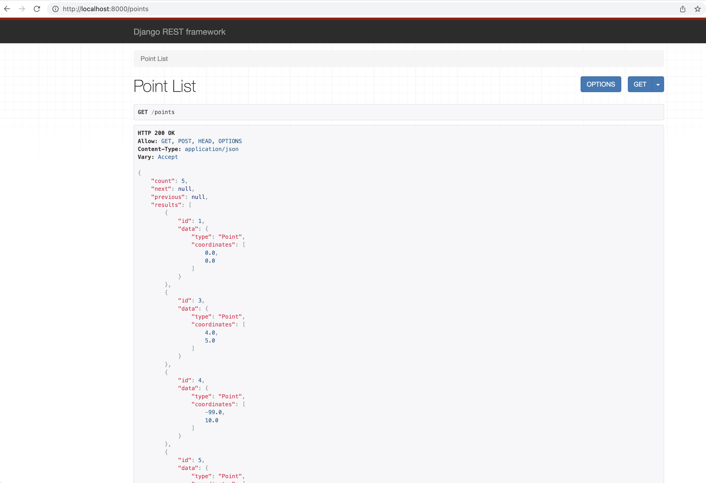
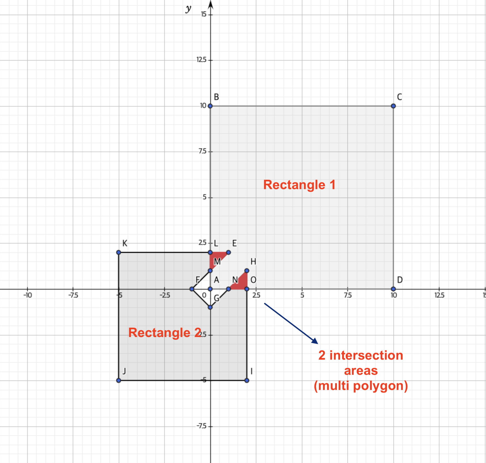

# Tasks
- [x] Decide on the format => GeoJSON
- [x] Implement API endpoints
    - [x] Core logics
    - [x] Each point and contour should have a unique identifier which is either an auto-incremented value or UUID. => auto-incremented
    - [x] Support pagination for GET list endpoints
    - [x] validation: the x value is in range of -180 to 180, and the y value is in range of -90 to 90
    - [x] validation: only simple polygons are accepted (contour)
- [x] Document commands to launch, stop and test the application
- [x] Document architecture of the application
- [x] Design of data model
- [x] Document API endpoints

# How to run

## 1. Using Docker

```
docker build . -t geo-app-docker
docker run -i -t -p 8000:8000 geo-app-docker
```

## 2. Without Docker

- Set up python virtual environment (for macOS)
  - If not macOS, please follow https://docs.djangoproject.com/en/4.1/ref/contrib/gis/install/ (follow `sqlite`)

```shell
brew install pyenv # if pyenv is not installed on the machine, follow https://github.com/pyenv/pyenv#homebrew-in-macos

# to fix SQLITE error (load_extension off error)
PYTHON_CONFIGURE_OPTS="--enable-loadable-sqlite-extensions" \
LDFLAGS="-L/usr/local/opt/sqlite/lib" \
CPPFLAGS="-I/usr/local/opt/sqlite/include" \
pyenv install 3.10.6

# if `error: System version of SQLite does not support loadable extensions` error appears while running the above command, install sqlite3 again using brew
brew install sqlite3 
echo 'export PATH="/usr/local/opt/sqlite/bin:$PATH"' >> ~/.zshrc
export LDFLAGS="-L/usr/local/opt/sqlite/lib"
export CPPFLAGS="-I/usr/local/opt/sqlite/include"

# If error on LDFLAGS or CPPFLAGS above,
# check sqlite directory using `brew info sqlite` or `which sqlite` or `which sqlite3`

pyenv local 3.10.6
python -m venv venv
source venv/bin/activate
```

- Install required packages
```shell
pip install --upgrade pip
pip install -r requirements.txt

brew install gdal
brew install libgeoip
brew install spatialite-tools
```

- Run server
```shell
python manage.py migrate
python manage.py runserver
```

- If you face an error (`django.db.utils.OperationalError: error in trigger ISO_metadata_reference_row_id_value_insert: no such column: rowid`) while running `python manage.py migrate`, run below and try again. ([reference](https://code.djangoproject.com/ticket/32935))

```shell
rm db.sqlite3
./manage.py shell -c "import django;django.db.connection.cursor().execute('SELECT InitSpatialMetaData(1);')";
python manage.py migrate
python manage.py runserver
```

# Data model
- Two models exist: `Point` and `Contour`.
- They have `id` field which is automatically added from Django side. 
- They have `data` field which is a GEOSGeometry object.
- `api/models.py`
```python
from django.contrib.gis.db import models

class Point(models.Model):
    data = models.PointField()

class Contour(models.Model):
    data = models.PolygonField()
```

# Architecture of the app
- Server application: It basically uses 3 packages: `Django` + `Django-rest-framework` + `djangorestframework-gis`
- DB: `sqlite` was used for simplicity. Also, the db file `db.sqlite3` was included in the version control for an easier setup process. Some sample data are included in the DB file as well.

### Django
- `geo_app`: boilerplate app. It has `settings.py` for the configuration of the whole app.
- `api`: All the business logics reside here.

### Django-rest-framework
- [DRF(Django-rest-framework)](https://www.django-rest-framework.org/) was implemented to reduce lots of code duplication on common API endpoint functionalities, serialization and validation.
- [Concrete View Class](https://www.django-rest-framework.org/api-guide/generic-views/#concrete-view-classes) functionality was used to drastically reduce the amount of code.

### djangorestframework-gis
- `djangorestframework-gis` was applied to handle input/output data in GeoJSON format.
- Without `djangorestframework-gis`, GEOSGeometry object is returned like this
```json
{
    "id": 1,
    "data": "SRID=4326;POINT (9.999 9.999)"
}
```

- With `djangorestframework-gis`,
```json
{
    "id": 1,
    "data": {
        "type": "Point",
        "coordinates": [
            9.999,
            9.999
        ]
    }
}
```

# Things for further improvement
- GEOSGeometry data conversion: JSON <=> Python dict
    - Here, `json.loads(geom.json)` is encoding GEOSGeometry object into JSON format, and then decoding it again into Python dict.
    - This is because I was using the ready-made `djangorestframework-gis` and I couldn't find a way to directly convert `geom` into a python dict that I want.
    - To avoid this performance loss from this, I will need to build a custom GEOSGeometry serializer.

```python
    # api/views.py
    def retrieve(self, request: Request, *args, **kwargs):
        contour1 = self.get_object()
        contour2 = get_object_or_404(models.Contour, pk=self.request.query_params.get('contour'))
        geom = contour1.data.intersection(contour2.data)
        serializer = self.get_serializer(json.loads(geom.json))
        return Response(data=serializer.data)
```

- GEOSGeometry data format serialization is not centralised
    - Only `ContourIntersectionView`'s output is serialized from custom serializer `GEOSGeometrySerializer`, while others are serialized implicitly by `djangorestframework-gis` since `'rest_framework_gis'` is in `INSTALLED_APPS` in `settings.py`. (See [link](https://github.com/openwisp/django-rest-framework-gis#geomodelserializer-deprecated))
    - In case `djangorestframework-gis` library is deprecated or somehow changes the output format, our API data representation can be affected. To remove this dependency, I will need to build up my own custom serializers.
    - Considering the life expectancy of this assignment, the library is not likely to deprecate or change any time soon - so I didn't implement this.

# Sample request & response

### URL

- `http://localhost:8000`




### [GET] `/points`

</a>

<details><summary>Response</summary>

```json
{
    "count": 2,
    "next": null,
    "previous": null,
    "results": [
        {
            "id": 1,
            "data": {
                "type": "Point",
                "coordinates": [
                    9.999,
                    9.999
                ]
            }
        },
        {
            "id": 2,
            "data": {
                "type": "Point",
                "coordinates": [
                    1.0,
                    2.0
                ]
            }
        }
    ]
}
```
</details>

Returns the list of points stored in database with JSON format described as above.
Pagination is supported.

### [GET] `/points/<id>`

<details><summary>Response</summary>

```json
{
    "id": 1,
    "data": {
        "type": "Point",
        "coordinates": [
            9.999,
            9.999
        ]
    }
}
```
</details>

Returns a point matching to the identifier with the JSON format described above.

<a name="/contours">

### [GET] `/contours`

</a>

<details><summary>Response</summary>

```json
{
    "count": 2,
    "next": null,
    "previous": null,
    "results": [
        {
            "id": 1,
            "data": {
                "type": "Polygon",
                "coordinates": [
                    [
                        [
                            1.0,
                            2.0
                        ],
                        [
                            -5.0,
                            2.0
                        ],
                        [
                            -5.0,
                            -5.0
                        ],
                        [
                            2.0,
                            -5.0
                        ],
                        [
                            2.0,
                            1.0
                        ],
                        [
                            0.0,
                            -1.0
                        ],
                        [
                            -1.0,
                            0.0
                        ],
                        [
                            1.0,
                            2.0
                        ]
                    ]
                ]
            }
        },
        {
            "id": 2,
            "data": {
                "type": "Polygon",
                "coordinates": [
                    [
                        [
                            0.0,
                            0.0
                        ],
                        [
                            10.0,
                            0.0
                        ],
                        [
                            10.0,
                            10.0
                        ],
                        [
                            0.0,
                            10.0
                        ],
                        [
                            0.0,
                            0.0
                        ]
                    ]
                ]
            }
        }
    ]
}
```
</details>

Returns the list of contours stored in database with JSON format described above.
Pagination is supported.

### [GET] `/contours/<id>`

<details><summary>Response</summary>

```json
{
    "id": 1,
    "data": {
        "type": "Polygon",
        "coordinates": [
            [
                [
                    1.0,
                    2.0
                ],
                [
                    -5.0,
                    2.0
                ],
                [
                    -5.0,
                    -5.0
                ],
                [
                    2.0,
                    -5.0
                ],
                [
                    2.0,
                    1.0
                ],
                [
                    0.0,
                    -1.0
                ],
                [
                    -1.0,
                    0.0
                ],
                [
                    1.0,
                    2.0
                ]
            ]
        ]
    }
}
```
</details>

Returns a contour matching the identifier with the JSON format described as above.

### [POST] `/points`

<details><summary>Request Body</summary>

```json
{
  "data": {
    "type": "Point",
    "coordinates": [1, 2]
  }
}
```
</details>

<details><summary>Response</summary>

```json
{
    "id": 3,
    "data": {
        "type": "Point",
        "coordinates": [
            1.0,
            2.0
        ]
    }
}
```
</details>

Create a point with the format described as above.

### [POST] `/contours`

<details><summary>Request Body</summary>

```json
{
  "data": {
    "type": "Polygon",
    "coordinates": [
        [
            [0,0], [10,0], [10,10], [0,10], [0,0]
        ]
    ]
  }
}
```
</details>

<details><summary>Response</summary>

```json
{
    "id": 2,
    "data": {
        "type": "Polygon",
        "coordinates": [
            [
                [
                    0.0,
                    0.0
                ],
                [
                    10.0,
                    0.0
                ],
                [
                    10.0,
                    10.0
                ],
                [
                    0.0,
                    10.0
                ],
                [
                    0.0,
                    0.0
                ]
            ]
        ]
    }
}
```
</details>

Create a contour with the format described as above.

### [PATCH] `/points/<id>`

<details><summary>Request Body</summary>

```json
{
  "data": {
    "type": "Point",
    "coordinates": [2, 4]
  }
}
```
</details>

<details><summary>Response</summary>

```json
{
    "id": 3,
    "data": {
        "type": "Point",
        "coordinates": [
            2.0,
            4.0
        ]
    }
}
```
</details>

Update a point matching to the identifier with the format described as above.

### [PATCH] `/contours/<id>`

<details><summary>Request Body</summary>

```json
{
  "data": {
    "type": "Polygon",
    "coordinates": [
        [
            [0,0], [1,1], [3,0], [0,0]
        ]
    ]
  }
}
```
</details>

<details><summary>Response</summary>

```json
{
    "id": 3,
    "data": {
        "type": "Polygon",
        "coordinates": [
            [
                [
                    0.0,
                    0.0
                ],
                [
                    1.0,
                    1.0
                ],
                [
                    3.0,
                    0.0
                ],
                [
                    0.0,
                    0.0
                ]
            ]
        ]
    }
}
```
</details>

Update a contour matching to the identifier with the format described as above.

### [DELETE] `/points/<id>`

Delete a single point matching the identifier. If successful, it returns no content with status 204.

### [DELETE] `/contours/<id>`

Delete a single contour matching the identifier. If successful, it returns no content with status 204.

---

## Advanced API Requirements

### [GET] `/points?contour=<id>`

  - When the query parameter `contour` is appended to [[GET]/points](#/points) API, it returns points within the inner area of the contour specified by `id`.

<details><summary>Response</summary>

```json
{
    "count": 2,
    "next": null,
    "previous": null,
    "results": [
        {
            "id": 1,
            "data": {
                "type": "Point",
                "coordinates": [
                    9.999,
                    9.999
                ]
            }
        },
        {
            "id": 3,
            "data": {
                "type": "Point",
                "coordinates": [
                    2.0,
                    4.0
                ]
            }
        }
    ]
}
```
</details>

### [GET] `/contours/<id1>/intersections?contour=<id2>`

This API calculates the contours of intersection area between contour `id1` and `id2`, and returns the results with following JSON format.

- Example



<details><summary>Rectangle 1</summary>

```json
{
    "data": {
        "type": "Polygon",
        "coordinates": [
            [
                [
                    0.0,
                    0.0
                ],
                [
                    0.0,
                    10.0
                ],
                [
                    10.0,
                    10.0
                ],
                [
                    10.0,
                    0.0
                ],
                [
                    0.0,
                    0.0
                ]
            ]
        ]
    }
}
```
</details>

<details><summary>Rectangle2</summary>

```json
{
    "type": "Polygon",
    "coordinates": [
        [
            [
                -5.0,
                2.0
            ],
            [
                1.0,
                2.0
            ],
            [
                -1.0,
                0.0
            ],
            [
                0.0,
                -1.0
            ],
            [
                2.0,
                1.0
            ],
            [
                2.0,
                -5.0
            ],
            [
                -5.0,
                -5.0
            ],
            [
                -5.0,
                2.0
            ]
        ]
    ]
}
```
</details>

<details><summary>Response</summary>

```json
{
    "type": "MultiPolygon",
    "coordinates": [
        [
            [
                [
                    1.0,
                    2.0
                ],
                [
                    0.0,
                    1.0
                ],
                [
                    0.0,
                    2.0
                ],
                [
                    1.0,
                    2.0
                ]
            ]
        ],
        [
            [
                [
                    2.0,
                    1.0
                ],
                [
                    2.0,
                    0.0
                ],
                [
                    1.0,
                    0.0
                ],
                [
                    2.0,
                    1.0
                ]
            ]
        ]
    ]
}
```
</details>
